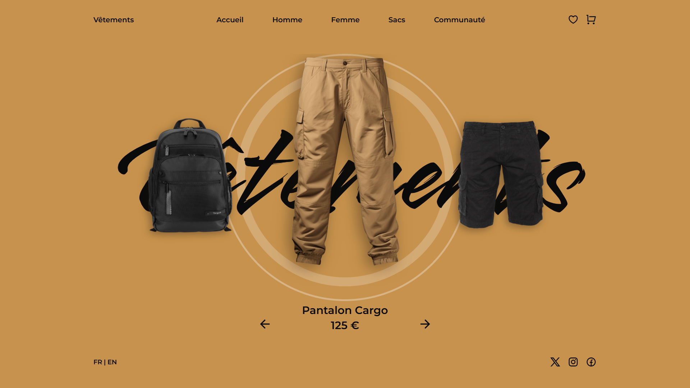

<div align="center">  
  <a href="https://image-slider-clothing.netlify.app/" target="_blank">  
      
  </a>  
  </br></br>  
  <h3 align="center">👕 Image Slider de Vêtements</h3>  
</div>

## <br /> 📌 Sommaire

&nbsp;&nbsp;&nbsp; 🎨 &nbsp; [**Introduction**](#introduction)<br />
&nbsp;&nbsp;&nbsp; 🛠️ &nbsp; [**Technologies**](#technologies)<br />
&nbsp;&nbsp;&nbsp; 🎯 &nbsp; [**Fonctionnalités**](#fonctionnalités)<br />
&nbsp;&nbsp;&nbsp; 🚀 &nbsp; [**Installation**](#installation)<br />

## <br /> <a name="introduction">🎨 Introduction</a>

Slider interactif de vêtements avec navigation fluide, design moderne et responsive.

Chaque slide présente un produit (nom, prix, image) au sein d’un carrousel animé avec **Swiper.js**, **ScrollReveal**, et **CSS personnalisé**.

Idéal pour projets e-commerce, landing pages ou galeries de collections mode.

## <br /> <a name="technologies">🛠️ Technologies</a>

- HTML5 sémantique
- CSS3 moderne (variables, media queries, transitions)
- JavaScript ES6
- [Swiper.js](https://swiperjs.com/)
- [ScrollReveal](https://scrollrevealjs.org/)
- Remix Icons

## <br /> <a name="fonctionnalités">🎯 Fonctionnalités</a>

- Slider horizontal avec navigation par flèches
- Animation d’entrée via ScrollReveal
- Menu mobile animé (show/hide)
- Responsive sur tous formats (desktop / mobile)
- Interface épurée et modulaire
- Section footer avec liens sociaux et langues

## <br /> <a name="installation">🚀 Installation</a>

### ✅ Prérequis

- Navigateur moderne (Chrome recommandé)
- Éditeur de code (VS Code)

### 📥 Cloner le projet

```bash
git clone https://github.com/ValentinMadiot/img-slider-clothing_js.git
```

### ▶️ Lancer localement

Il suffit d’ouvrir le fichier index.html dans un navigateur, ou d’utiliser l’extension Live Server sur VS Code.
